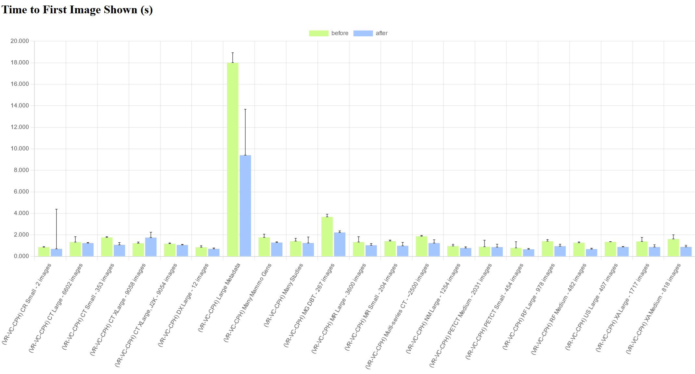
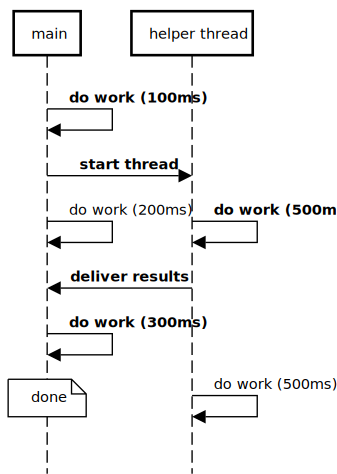
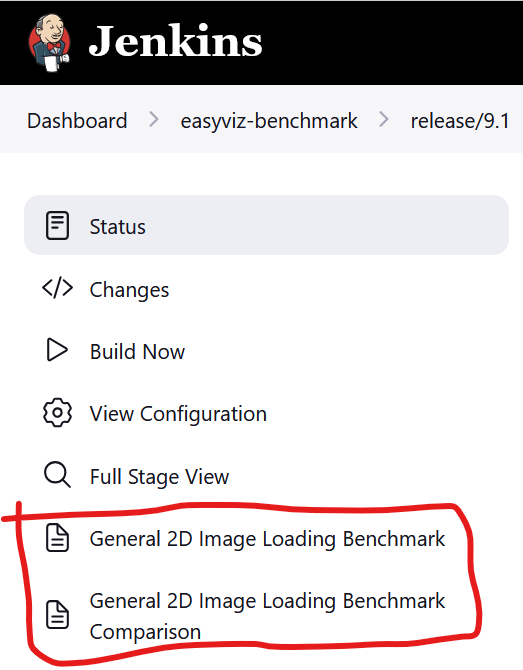
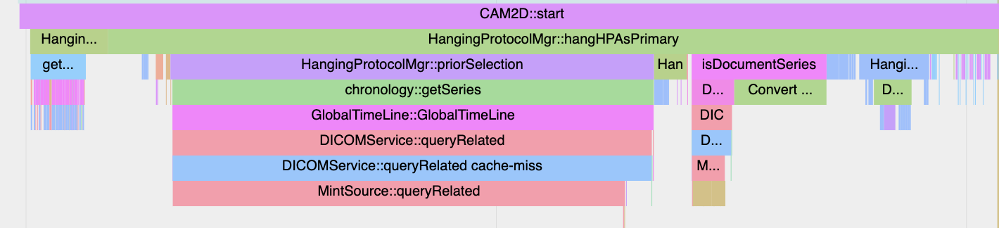
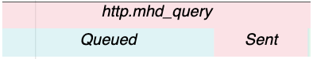
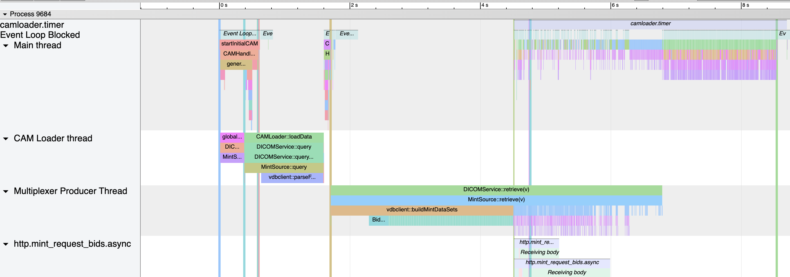
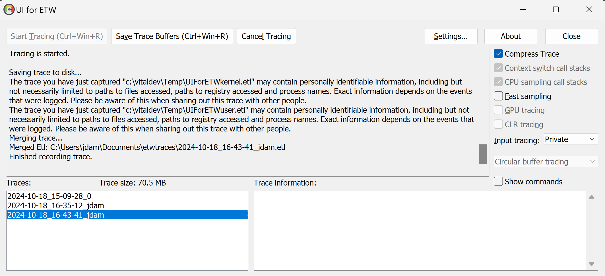
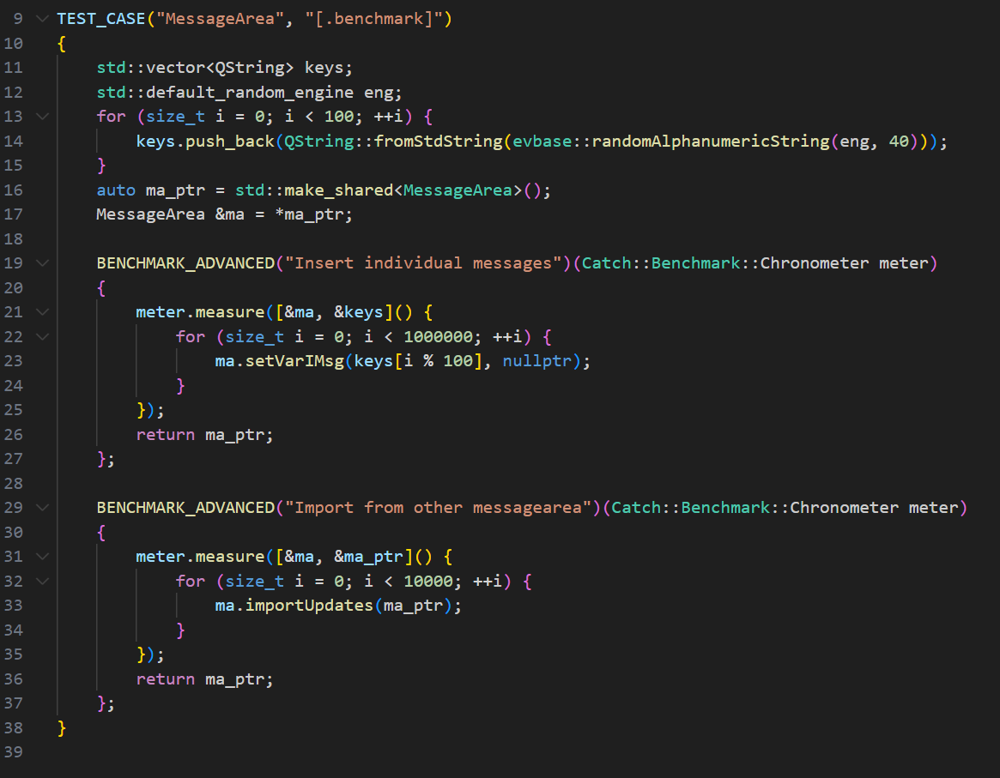

class: center, middle, title
background-image: url(style/main-title-background.jpeg)

# Making VR go fast
## Jesper Alf Dam

---
layout: true
class: regular
name: normal-template
<div class="header"></div>
<div class="footer"></div>

---
layout: false
class: center, middle, sectiontitle
background-image: url(style/section-title-background.jpeg)

# Introduction
## General concepts and tools

---
layout: true
template: normal-template
---
# Introduction
What's the big deal?
???
Before we spend too much time on my work, it's worth asking if it made a difference

--



(https://jalfd.github.io/vr-benchmarks/9.1-beforeafter/)

---
# Introduction

Questions:

1. How did I find these bottlenecks?
2. How did I fix them?

--

But mostly #1

---

# Important Concepts

--

* **The 90/10 rule**:
--
 (90% of the execution time is spent in 10% of the code)
--

    * *Most of the code isn't worth optimizing*
--
    * *the most expensive code is easy to find!*
--
        * Stop the program at a random time, and you have a 90% chance of hitting expensive code

???
If no fancy tools, run pstack a few times

--
.right-column-33[]
* **The Critical Path**:
--
 it doesn't matter how long code takes if we're not waiting for it
    * time spent while waiting for a slower operation doesn't matter
    * Example: CAM construction in parallel with early request
    * if no one is waiting for it, the time we spend doesn't matter
    * Example: background decompression or shutdown

---
# Tools

* general2d-bench
* (Chromium) trace files
* ETW/Windows Performance Analyzer (Windows only)

???
Would like to introduce a few tools I find useful.

--

On Linux, `perf` and `hotspot` are your friends, and eBPF probably even more so.

---
# general2d-bench

.right-column-33[]
* "What is our TTFI (or other measurement) across a range of studies?"
* "how does it compare to another version or configuration?"
???
Useful as a starting point

--

* High-level performance reporting tool
* Runs nightly on Jenkins (Linux only)
* Launches CAMs for a selection of studies and archives and generates an HTML report
* Can visualize a single run, or compare multiple

(https://jenkins-cp.devx.vitalimages.com/job/easyviz-benchmark/job/release%252F9.1/)
???
Jenkins Windows is hopefully coming soon

---
# Generating a single benchmark

```
/install/bin/general2d-bench -a ../general2d/tests/bench_aets.json \
  -s ../general2d/tests/bench_studies.json -i3 -o out-dir
```
--
* using AE titles from `../general2d/tests/bench_aets.json`
* using studies from `../general2d/tests/bench_studies.json`
* run 3 iterations
* write the report to `../out-dir`
--

* report will be written to `../out-dir/index.html`
* data will be written to `../out-dir/stats.json`
???
Note, html needs to be http hosted
---
# Generating benchmark comparison

* Run a single benchmark for each configuration, with different output dirs
* run scripts/build-multi-benchmark.mjs to combine the results

--
```
node scripts/build-multi-benchmark.mjs out-dir <<EOF
[
    {
            "name": "before",
            "platform": "windows",
            "url": "outdir-0/stats.json"
    },
    {
            "name": "after",
            "platform": "windows",
            "url": "outdir-1/stats.json"
    }
]
EOF
```
???
Platform is so we can separate windows and linux 

Has a bunch of other properties too
--
* Shorthand for fetching Jenkins data:
```
echo ["8.5", "9.0", "9.1"] | \
node scripts/build-multi-benchmark.mjs out-dir
```
---

# Trace Files

* Useful for understanding the broad _shape_ of a CAM execution: what happens when, and in which order?
* Generates a swimlane diagram showing when specific operations begin and end, and on which threads
* Uses a simple JSON format
* Can be viewed in Chromium-based browsers (including Edge)
* To generate, set MI_ENABLE_TRACE_FILE=1
* On CAM exit, trace file is written to `/tmp/vitrea-read-trace-$PID.json`

(Reference: https://docs.google.com/document/d/1CvAClvFfyA5R-PhYUmn5OOQtYMH4h6I0nSsKchNAySU/preview?tab=t.0#heading=h.yr4qxyxotyw)

---

# Trace Files: Data Model

* Sync events: have a start and end time, and are associated with a specific thread
* Typically correspond to entering and leaving a scope
* Sync events which fit within another on the same thread is rendered nested under it, forming a kind of stack trace

```
const auto scoped_trace = Tracer::instance().sync();
```



---

# Trace Files: Data Model

* Async events: have a start and end time, but not tied to a thread
* Async events can also be nested, by linking to the parent event ID
* Typically correspond to non-CPU operations like network requests
```
const auto id = Tracer::instance().asyncStart("outer", ...);
Tracer::instance().asyncStart("inner", id);
Tracer::instance().asyncEnd("inner", id, ...);
Tracer::instance().asyncEnd("outer", id, ...);
```

.center[]

---

# Trace Files: Viewing

* In a Chromium-based browser, go to `about://tracing` and click *Load*
.right-column-20[]
* zoom/pan with W,S,A,D or with the mouse controls
* X-axis (top): timeline
* Y-axis (left): threads and async names

.center[]
???
On enter: we can also mark specific times: vertical lines

End: walk through: can show cam start, early request, retrieval and event loop block

---

# Windows Performance Analyzer (WPA)

* Powerful tool for graphing, organizing and searching a wide range of performance data collected through ETW (Event Tracing for Windows)

???
A profiler, but a lot more than that
--

* ETW can collect:
    * stack traces from *all* running threads/processes every 1ms
    * stack traces on thread context switches
    * file or network I/O
    * GPU operations
    * stack traces for every memory allocation
    * and so much more
    * including custom user-defined data
--
* To record an ETW file, run Windows Performance Recorder
* To analyze an ETW file, run Windows Performance Analyzer
* I recommend UIforETW as a convenient front-end
* Resources
    * https://randomascii.wordpress.com/2015/09/24/etw-central/
    * https://www.wintellectnow.com/Home/Instructor?instructorId=BruceDawson


---

# Recording a WPA trace with UIForETW



---

# Using WPA

* This tool can do _a lot_, most of which don't have time for (and much that I don't know about)
* The three views I used in this round of performance investigations:
    * **CPU Usage (Sampled)**: collects stack traces for every thread in every process once per ms
    * **CPU Usage (Precise)**: records every thread context switch:
        * Who started running?
        * Who enabled them to run?
        * Who stopped running?
    * **CPU Usage (Sampled) -> Flame by Process, Stack**: CPU Flame graph
--
* [Demo time!]
???
Sampled: load symbols, show we can zoom and filter: camloader, hand zoom, process span zoom

Expand stack: explain top frames, then drill down to PSB

Add thread name, Drill to bottom, show that it shows thread name

Move column and add tid, to show grouping

Explain color dividers

Then move on to flame graph (add under sampled), filter to main thread, hide table

Pick a timespan in Sampled and zoom to that, show that it affects all

Precise: Shows when threads begin and end

Select main thread, zoom to busy part, pick the pause, drill through graphs

Explain reorder threads (main is 39220), but don't drill down
---

# WPA: Recap:

* Filter on process/thread/whatever you're interested in
* Zoom to just the time span you care about (Shared across views)
* Add/remove/reorder columns to structure data:
    * Left of Yellow: Expandable, letting you drill down
    * Right of Yellow: Aggregates (min/max/sum/avg) and scalar values
    * Right of Blue: Data to plot in graph
* "Flame Graph" is just a visualization: Any table can be arranged as a flame graph

---
layout: false
class: center, middle, sectiontitle
background-image: url(style/section-title-background.jpeg)

# Part 2: Deep Dive

## Coffee break?

---
layout: true
template: normal-template
---

# Case 0: [2314794ec7~] Where do we even start?

* The benchmark says we're slower than we were in 9.0. Let's see if anything pops out
--

* Does the trace file tell us anything?
* [Demo time!]
???
Open trace file: Nothing really stands out, but widget construction seems a bit sus. Qt6 related?

On to WPA, Flame graph main thread (because widgets). Find peaks, follow them down
--

* Trace file suggests widget construction has gotten slower
* WPA tells us we keep ending up in QOpenGLContext::create and nvoglv64.dll
* Pure luck: we already have EV-11000 and it lists a fix!
---

# Case 1: [71e15f9d86~] Low hanging fruit

* GenerationSteppingTest is slow. I wonder if we can find some easy wins?
--

* Run the test and analyze in WPA
--

* [Demo time!]
???
Follow Sampled stack down to dcmObjectArrival. We know that always interesting, so let's take a look

this gives us a focus for flame graph. Zoom in, select main thread

Big block to the left, messagebox. Curious, but we're looking for easy wins, so exclude for now

Filter it out, what's left? Skim through, look for easy wins: ScaleDCS and visibleviewportshaveundrawn

--

* That is a lot of time spent showing a messagebox?!
    * interesting, but for another day.
* ScaleDCS takes 4.60% of the time? And it mostly just checks an environment variable?
    * We can cache that!
* MessageArea::importUpdates takes 8.80%? Nearly all in a std::map::operator[]?
    * Try a std::unordered_map?
???
We're confident first will be a win. Second one? How can we tell?

---

# Interlude: Microbenchmark

* Catch has support for creating function-level microbenchmarks
* Just run the test case and it prints performance numbers

???
Worth noting tags. Dot so it's not run normally, specify benchmark to run it

---

# Case 2: [774177b1ab~] Look at the slowest launch

* So far, we've kind of stumbled into a few incidental wins. Let's try looking at one of the really slow studies: SUSENG-7239 aka "Large Metadata"

    * 350MB of metadata we need to sort through before showing images
    * TTFI > 15 seconds.
--

* Full disclosure: Due to comparing against bad 8.5 data I *thought* this study had doubled its TTFI. It hadn't.
* [Demo time!]
???
Trace file: DICOMService::retrieve() is sloooow

and clearly waits for this wall of conversion tasks, each 800+ms

With this in mind, let's look at WPA:

Sampled: lol zoom to the big bulge

Flame: zoom to convertitem

Look at mutex, explain issue and fix

Say this goes away, isspace is left. Why does that have 1k samples?
--

* The trace file:
    * DICOMService::retrieve takes a looong time
    * and it clearly waits for all those convert tasks to be finished

* WPA:
    * `DcmUniqueIdentifier::makeMachineByteString()` acquires a contended mutex?
    * `isspace()` tries to access the thread's current locale?

---

# Case 3: [3f354dccbc~] Startup with high latency

* Load a small study (using a MSP archive, for some reason)
* [Demo time!]
???
CAM construction is slow, normalize is slow

We can explain normalize. What about CAM?

They look related. Are they?

Could be a coincidence? But it's sus. Look in WPA

Main thread, zoom startinitial

Find event, new stack, time since last
--

* Normalize is slow, and CAM2D construction can't proceed until it can get launch URIs
* and those are protected by a mutex held during normalize
    * make LaunchUris use two mutexes:
    * one to protect the original URIs
    * one to protect the generated (normalized) URIs

---

# Case 4: [99fcd8f827~] Can we find more?

* Let's have another look at the Large Metadata study
* [Demo time!]
???
Trace shows that we've solved the worker threads

Interesting: insertIntoDCMItem, createDicomObject

Main thread is ok, but it interacts with mux thread, could cause us to block?

Flame: filter to retrieve(), just below framecallback

new/clone, nothing exciting. Skim over slimcopy, it sounds reasonable

Unfilter -> main thread; skip exit/startup, find selectimage, horror!

unfilter, show both, mention slimcopy from before.

Explain: when we create a dicomobject, we clone the dcmtk dataset to create a "reduced" version without image data

Once all images have arrived, free reduced and use main

Select each flame to show magnitude. We can make it lazy!
--

* Our previous work on the worker threads paid off.
* The main thread does some quite expensive deletes *when receiving images*
* multiplexer thread spends time in `slimCopy()` on every `createDicomObject()`
* Make `slimCopy()` lazy!

---

# Summary


(https://jalfd.github.io/vr-benchmarks/9.1-beforeafter/)
